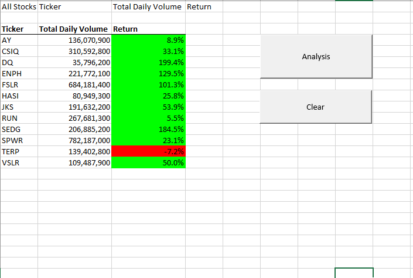
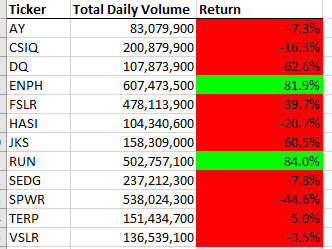
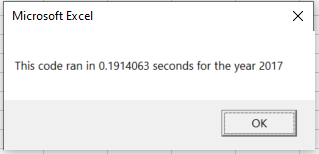
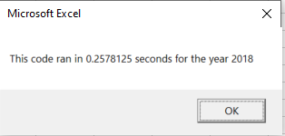

# stock-analysis

## Overview of Project: Explain the purpose of this analysis.
### Results: Using images and examples of your code, compare the stock performance between 2017 and 2018, as well as the execution times of the original script and the refactored script.
The primary goal of our challenge was to creat a macro for Steve to use to compare similar stocks in the Green Energy sector and to provide analysis on these stocks from years 2017-2018. Our secondary goal was to refactor this macro so that it is cleaner, runs faster, and is more interchangeable so that it can be used for additional stocks in the future. By comparing our results from 2017 and 2018

        
  
There are a few things we can see from these charts. For one we can compare the daily volumes of the tickers year over year. As you can see, DQ was heavily traded in 2018 compared to 2017. We can assume that the more a stock is traded the more accurate the value of a stock is. In 2018 DQ had ~300% more daily volume and had a yearly return of -62.6%. We can tell Steve's parents to stay away from this stock. In fact, the only two stocks with positive 2017 and 2018 returns are tickers ENPH and RUN, whose traded volumes both increased from 2017 -> 2018. These could be opportunities for his parents, but highlights a bigger issue: We are only providing analysis on 12 stocks!

This brings us to our secondary goal of our challenge which was to refactor our macro to make it cleaner and faster so it is able to handle bigger data sets. We did this by reformatting our arrays to make them more efficient using fewer steps, less memory and improved logic. After refactoring our code we were able to cut the run time to less than 30% of the run time. In addition, we can more easily add additional tickers into our array for further analysis. Below are the final run times we ended up with using our refactored macro:

                
  
After refactoring our macro we can confirm that Steve is ready for some real analysis on hundreds of stocks to find his parents the best options! With a succesful refactor you are able to perform more analysis in the future and control
  
## Summary: In a summary statement, address the following questions.
### What are the advantages or disadvantages of refactoring code?
The advantages of refactoring code is pretty simple. The code is fresher, more concise, easier to read and takes less run time. We are able to easily add more stocks into the arrays for further analysis, we are putting less stress on our machines to output our results. 

The disadvantages really can depend on what the refactoring entails and how experienced you are as a coder. My code worked perfectly fine before refactoring but upon attempting spent hours trying to figure out why my code was no longer running. Although the code becomes easier to read for a 3rd party, knowing what pieces of code to bring foward and what to leave behind creates opportunities for mistakes for an inexperienced coder such as myself. Refactoring can be time consuming during the process, but if you do it succesfully it will help your analysis and future tweeks moving forward.

### How do these pros and cons apply to refactoring the original VBA script?

As stated above, I ahd some issues refactoring my data. Module 2 was able to walk me through my code for my original VBA script, but the challenge had a bit less hand holding. This lead to me spending even more time refactoring than I did writing the original code! All of this aside, by the end I feel like I understand VBA as a whole much more, and seeing parrallels between original vba code and our refactored code helped me see the concept that the same problem can be solved through coding in many different ways! 
