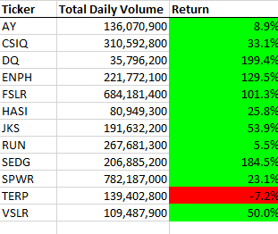

# stock-analysis

## Overview of Project: Explain the purpose of this analysis.
### Results: Using images and examples of your code, compare the stock performance between 2017 and 2018, as well as the execution times of the original script and the refactored script.
The primary goal of our challenge was to creat a macro for Steve to use to compare similar stocks in the Green Energy sector and to provide analysis on these stocks from years 2017-2018. Our secondary goal was to refactor this macro so that it is cleaner, runs faster, and is more interchangeable so that it can be used for additional stocks in the future. By comparing our results from 2017 and 2018

         There are a few things we can see. 

## Summary: In a summary statement, address the following questions.
### What are the advantages or disadvantages of refactoring code?
### How do these pros and cons apply to refactoring the original VBA script?
